

  <picture>
    <source media="(prefers-color-scheme: dark)" srcset="images/dark-logo.png">
    
  </picture>

A browser-based racing game built with [Phaser 3](https://phaser.io/), GitHub Copilot, Claude Sonnet 4.6 + 4.7. Inspired by the classic [Micro Machines](https://highwayforever.wordpress.com/2022/03/04/micro-machines-codemasters-1991/) and [Ivan "Ironman" Stewart's Super Off Road](https://vintagearcade.net/shop/arcade-games/super-off-road-arcade-game/) games. Built for [GameDev.js 2026 game jam](https://itch.io/jam/gamedevjs-2026).

## Play

Open `index.html` in a browser.

## Features

- 4-player race (1 human + 3 AI opponents): Copilot, Frank, Hubot, and Mona
- Procedurally generated tracks
- Pickups, nitro boosts, and mud/terrain effects
- Multiple race tracks with unique music

<!-- MAPS_START -->
## Maps

23 tracks, each with a unique theme and visual style.

<table>
  <thead>
    <tr>
      <th>#</th>
      <th>Map</th>
      <th>Screenshot</th>
      <th>Inspiration</th>
      <th>Theme</th>
    </tr>
  </thead>
  <tbody>
    <tr>
      <td align="center">1</td>
      <td><strong>SIDEWINDER</strong></td>
      <td>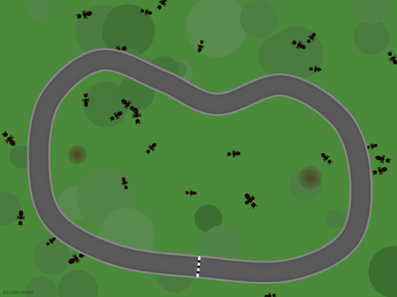</td>
      <td>Classic Micro Machines top-down circuit design</td>
      <td>Green grass and asphalt</td>
    </tr>
    <tr>
      <td align="center">2</td>
      <td><strong>FANDANGO</strong></td>
      <td>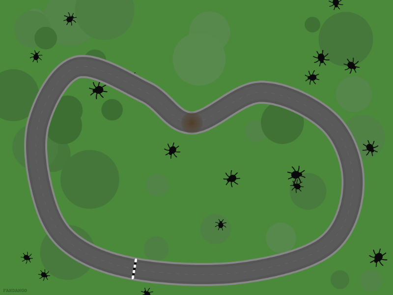</td>
      <td>Classic Micro Machines top-down circuit design</td>
      <td>Green grass and asphalt</td>
    </tr>
    <tr>
      <td align="center">3</td>
      <td><strong>WIPEOUT</strong></td>
      <td>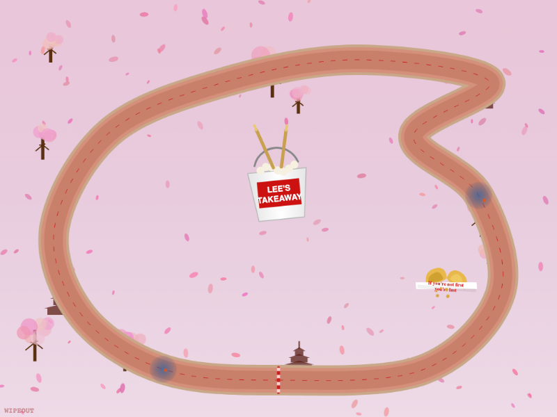</td>
      <td>Wipeout (Psygnosis, 1995) anti-gravity racer — name nod; classic top-down layout</td>
      <td>Japanese cherry blossom park with pagoda silhouettes</td>
    </tr>
    <tr>
      <td align="center">4</td>
      <td><strong>BLASTER</strong></td>
      <td>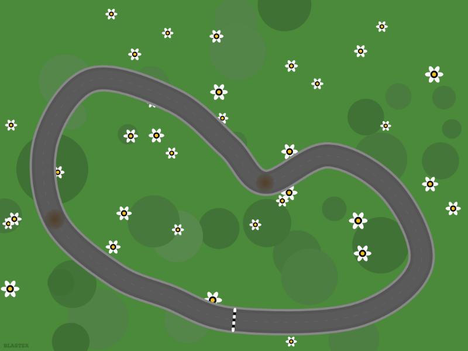</td>
      <td>Classic Micro Machines top-down circuit design</td>
      <td>Green grass and asphalt</td>
    </tr>
    <tr>
      <td align="center">5</td>
      <td><strong>HUEVOS GRANDE</strong></td>
      <td>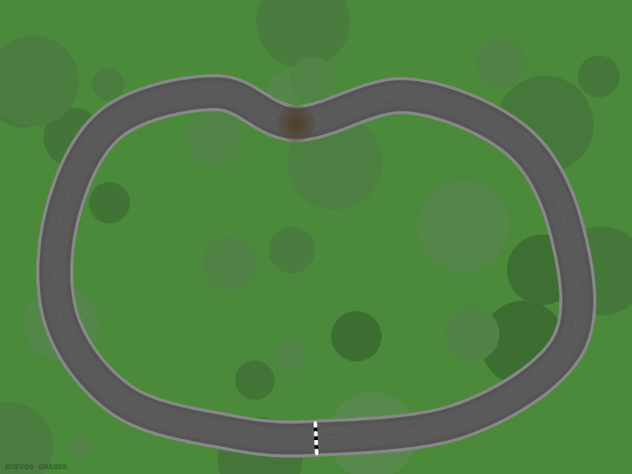</td>
      <td>Classic Micro Machines top-down circuit design</td>
      <td>Green grass and asphalt</td>
    </tr>
    <tr>
      <td align="center">6</td>
      <td><strong>CLIFFHANGER</strong></td>
      <td>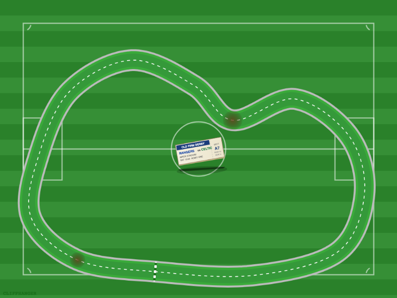</td>
      <td>Ibrox Stadium, Glasgow — Rangers vs Celtic Old Firm Derby</td>
      <td>Football pitch with centre circle and penalty boxes</td>
    </tr>
    <tr>
      <td align="center">7</td>
      <td><strong>BIG DUKES</strong></td>
      <td>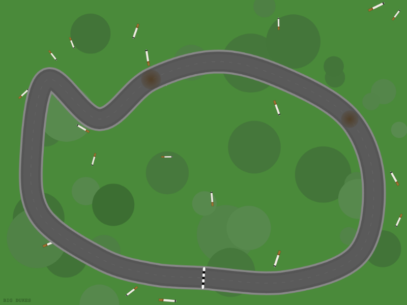</td>
      <td>The Dukes of Hazzard (TV series, 1979–85)</td>
      <td>Green grass and asphalt</td>
    </tr>
    <tr>
      <td align="center">8</td>
      <td><strong>HURRICANE GULCH</strong></td>
      <td>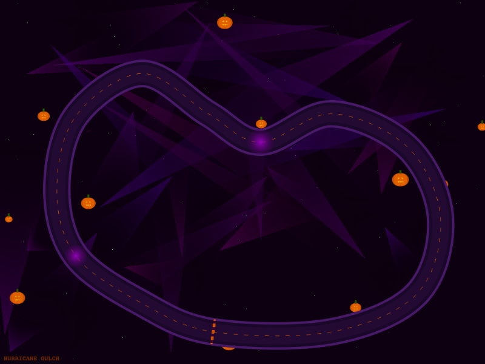</td>
      <td>Halloween seasonal event tracks in Micro Machines and Forza Horizon</td>
      <td>Halloween night — pumpkins, purple sky, glowing slime</td>
    </tr>
    <tr>
      <td align="center">9</td>
      <td><strong>SAFARI RUSH</strong></td>
      <td>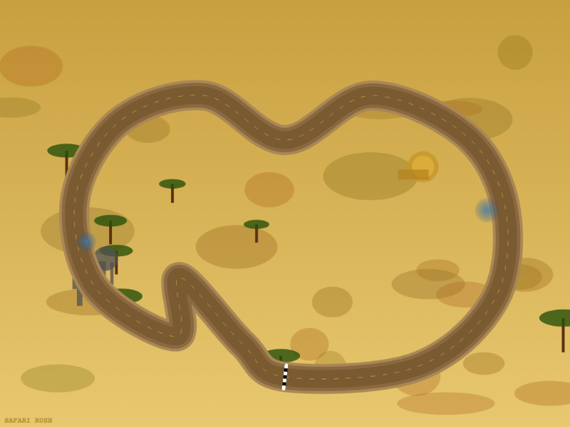</td>
      <td>Monaco Grand Prix — tight hairpins and narrow street circuit</td>
      <td>African savanna</td>
    </tr>
    <tr>
      <td align="center">10</td>
      <td><strong>DESERT MIRAGE</strong></td>
      <td>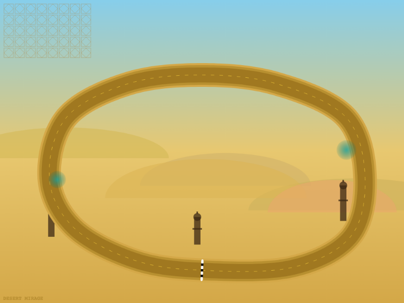</td>
      <td>Bahrain International Circuit / Yas Marina Circuit (Abu Dhabi F1)</td>
      <td>Arabian desert</td>
    </tr>
    <tr>
      <td align="center">11</td>
      <td><strong>COPACABANA CRUNCH</strong></td>
      <td>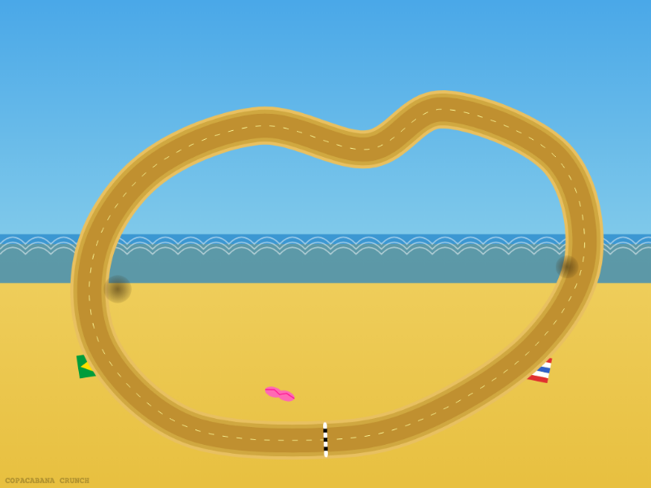</td>
      <td>Autódromo José Carlos Pace (Interlagos), São Paulo — Brazil F1</td>
      <td>Brazilian carnival</td>
    </tr>
    <tr>
      <td align="center">12</td>
      <td><strong>LONE STAR RALLY</strong></td>
      <td>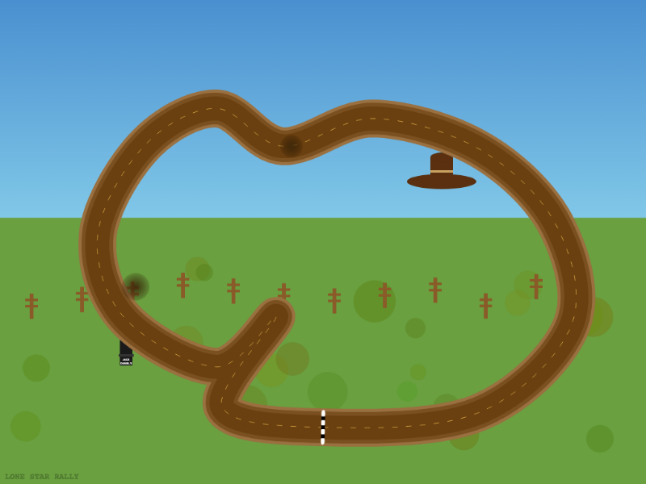</td>
      <td>Circuit of the Americas (COTA), Austin, Texas</td>
      <td>American country / Texas</td>
    </tr>
    <tr>
      <td align="center">13</td>
      <td><strong>JINGLE RALLY</strong></td>
      <td>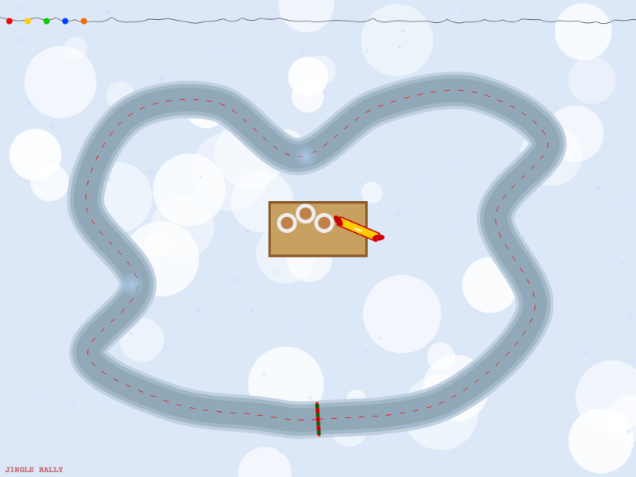</td>
      <td>Nürburgring Nordschleife — winding and highly technical layout</td>
      <td>Christmas / winter holiday</td>
    </tr>
    <tr>
      <td align="center">14</td>
      <td><strong>CURRY CORNER</strong></td>
      <td>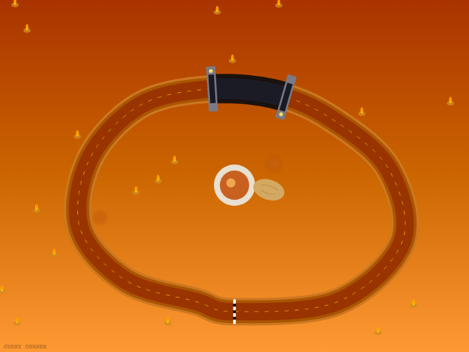</td>
      <td>Indian street circuit with a tunnel through a building</td>
      <td>India — Bollywood and Diwali</td>
    </tr>
    <tr>
      <td align="center">15</td>
      <td><strong>BELLA STRADA</strong></td>
      <td>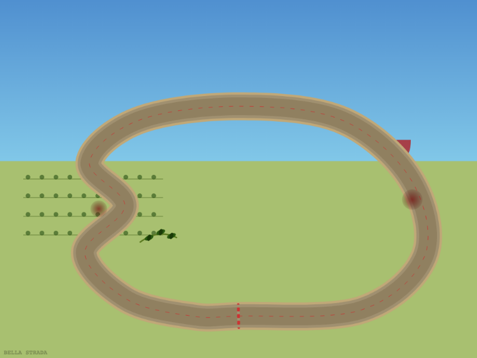</td>
      <td>Autodromo Nazionale Monza — fast main straight with Ascari chicane</td>
      <td>Italy</td>
    </tr>
    <tr>
      <td align="center">16</td>
      <td><strong>LOOSE SLOPS</strong></td>
      <td>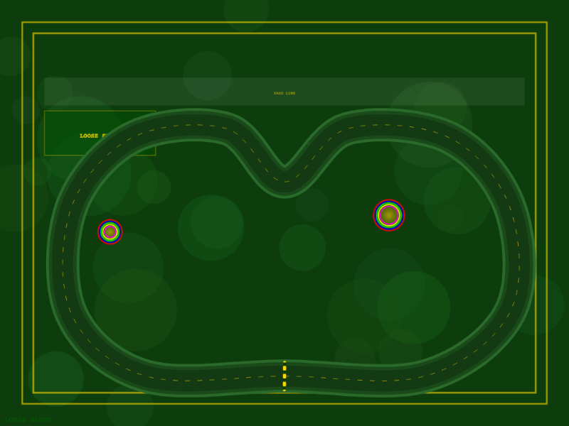</td>
      <td>Las Vegas Strip Circuit (F1, 2023) — 90° street corners and inner chicane</td>
      <td>Casino / Las Vegas</td>
    </tr>
    <tr>
      <td align="center">17</td>
      <td><strong>SHAMROCK SPRINT</strong></td>
      <td>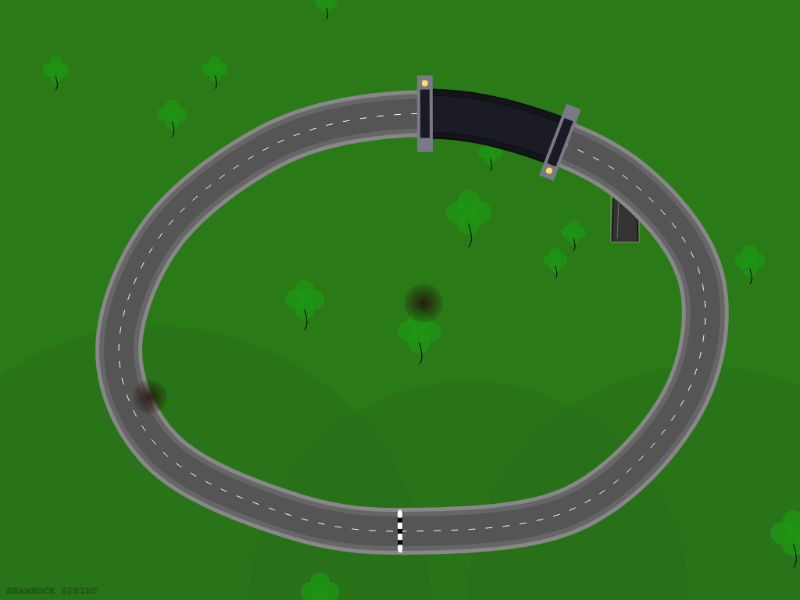</td>
      <td>Irish road racing circuits with a hilltop tunnel</td>
      <td>Ireland — rolling green hills</td>
    </tr>
    <tr>
      <td align="center">18</td>
      <td><strong>EL GRANDE LOOP</strong></td>
      <td>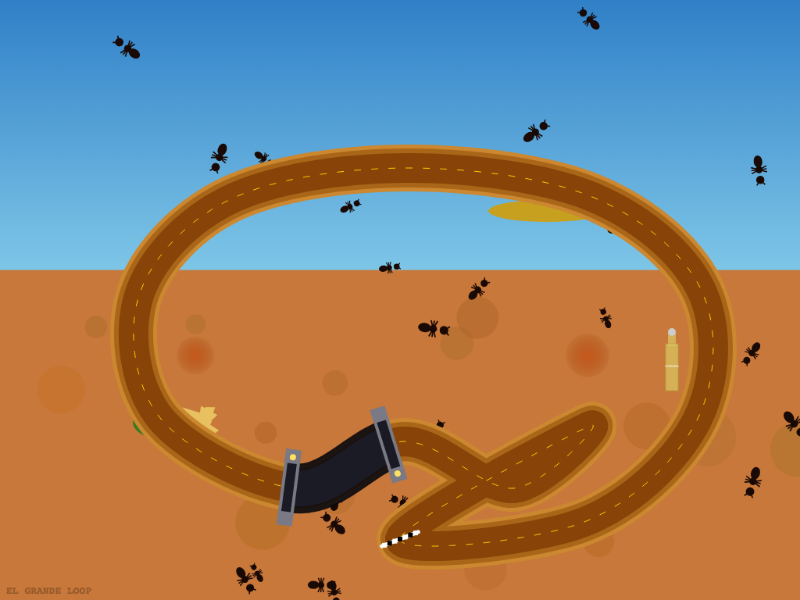</td>
      <td>Autódromo Hermanos Rodríguez, Mexico City Grand Prix</td>
      <td>Mexico — Day of the Dead and Mariachi</td>
    </tr>
    <tr>
      <td align="center">19</td>
      <td><strong>IRIE CIRCUIT</strong></td>
      <td>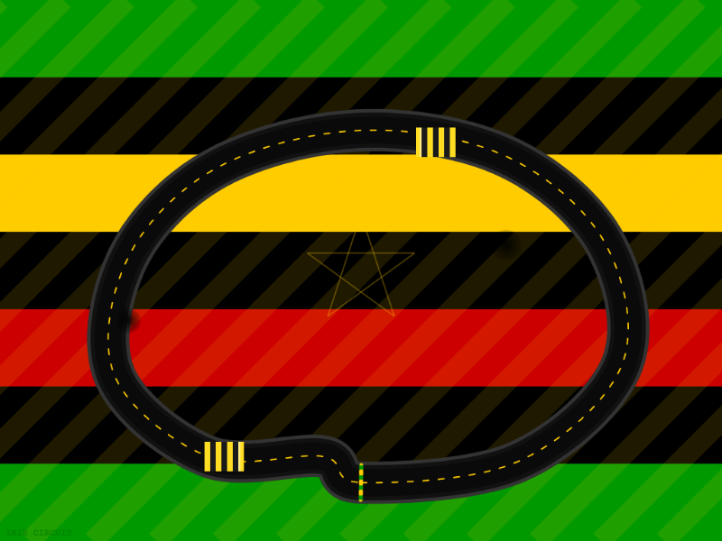</td>
      <td>Original layout with water-jump ramps</td>
      <td>Jamaica — reggae and island vibes</td>
    </tr>
    <tr>
      <td align="center">20</td>
      <td><strong>OLÉ DASH</strong></td>
      <td>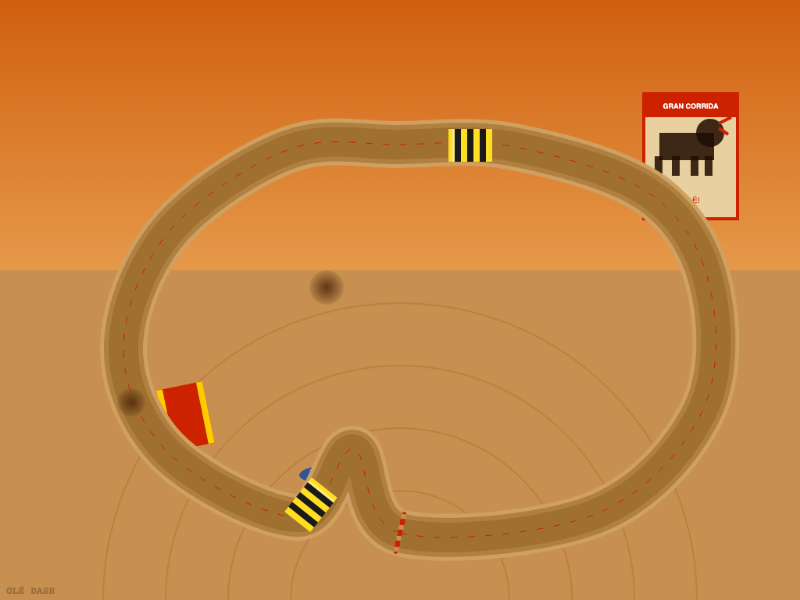</td>
      <td>Spanish arena-edge street circuit</td>
      <td>Spain — flamenco and bullfighting arena</td>
    </tr>
    <tr>
      <td align="center">21</td>
      <td><strong>JUNGLE JAMBOREE</strong></td>
      <td>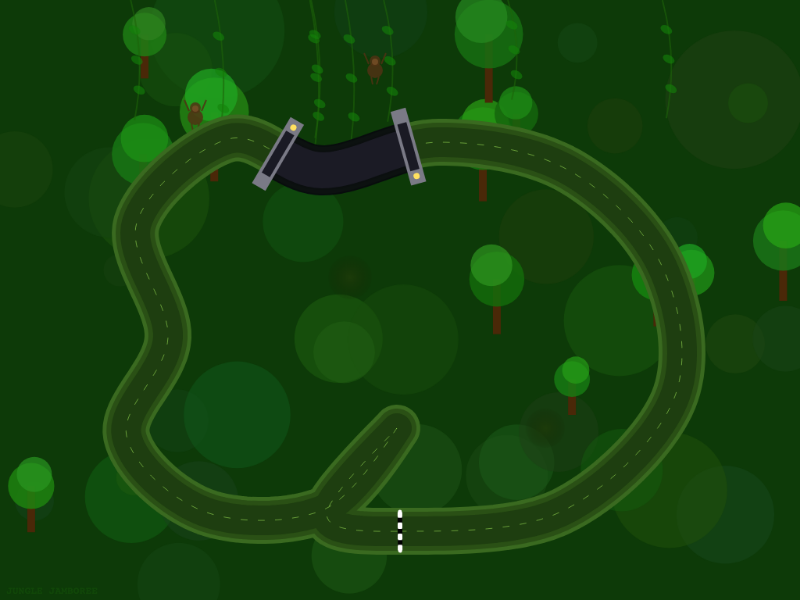</td>
      <td>Sepang International Circuit (Malaysia F1) / Singapore Street Circuit</td>
      <td>Tropical jungle with monkeys and hanging vines</td>
    </tr>
    <tr>
      <td align="center">22</td>
      <td><strong>NEON DRIVE</strong></td>
      <td>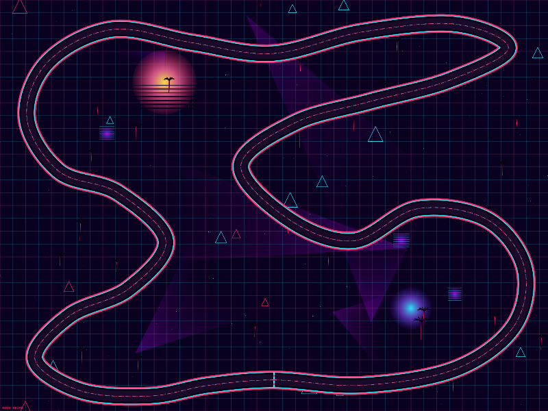</td>
      <td>OutRun (Sega, 1986) — multi-screen synthwave aesthetic</td>
      <td>1980s synthwave / retrowave neon grid</td>
    </tr>
    <tr>
      <td align="center">23</td>
      <td><strong>DESK CHAOS</strong></td>
      <td>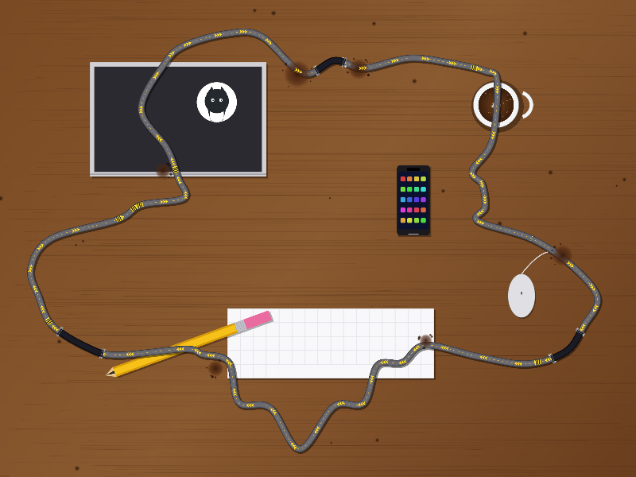</td>
      <td>Micro Machines (Codemasters, 1991) — kitchen table and desk levels</td>
      <td>Office desk — procedurally generated layout (different every run)</td>
    </tr>
  </tbody>
</table>

<!-- MAPS_END -->

## LICENSE

MIT.

Files in the `players/` directory are copyrighted by their respective owners and are included here for reference/attribution purposes only. All rights remain with their respective copyright holders. 

## Credits

- **Kenney** — game assets ([Racing Pack](https://kenney.nl/assets/racing-pack))
- **MFCC** — music ([Pixabay](https://pixabay.com/users/28627740/))
