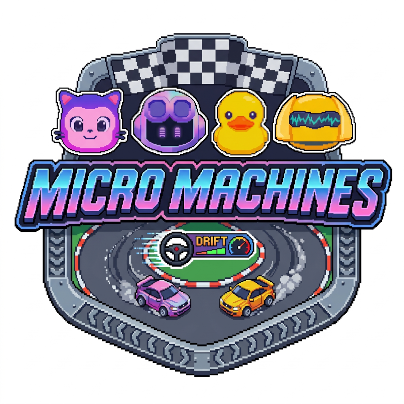

<picture>
  <source media="(prefers-color-scheme: dark)" srcset="images/dark-logo.png">
  <source media="(prefers-color-scheme: light)" srcset="images/light-logo.png">
  
</picture>

A browser-based racing game built with [Phaser 3](https://phaser.io/), inspired by the classic Micro Machines series.

## Play

Open `index.html` in a browser.

## Features

- 4-player race (1 human + 3 AI opponents): Copilot, Frank, Hubot, and Mona
- Procedurally generated tracks
- Pickups, nitro boosts, and mud/terrain effects
- Multiple race tracks with unique music

## Credits

- **Kenney** — game assets ([Racing Pack](https://kenney.nl/assets/racing-pack))
- **MFCC** — music ([Pixabay](https://pixabay.com/users/28627740/))
